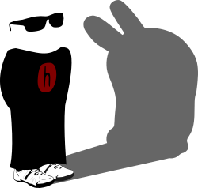

# Harvey OS

## What is Harvey?

Harvey is an effort to get the <a href="http://plan9.bell-labs.com/plan9/about.html">Plan 9</a> code working with <a href="https://gcc.gnu.org/">gcc</a> and <a href="http://clang.llvm.org/">clang</a>.

Our aim is to provide a modern, distributed, 64 bit operating system that does away with Unix's wrinkles and allows for new ways of working.

## News & events

* <a href="#">Harvey at Usenix</a>
* <a href="#">Getting ready for RC1</a>
* <a href="#">Progress on boot</a>
* <a href="#">Plan 9 Go</a>

