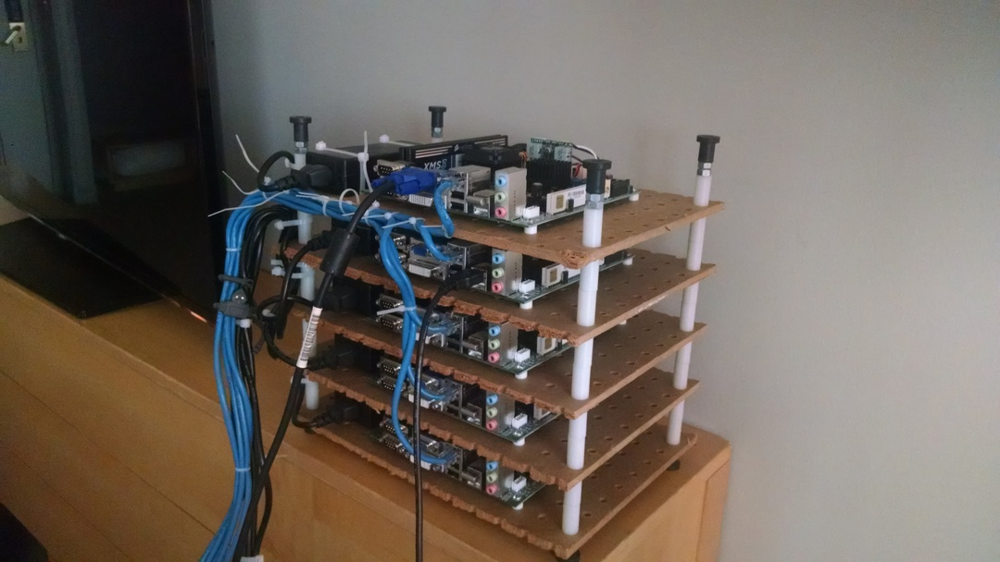
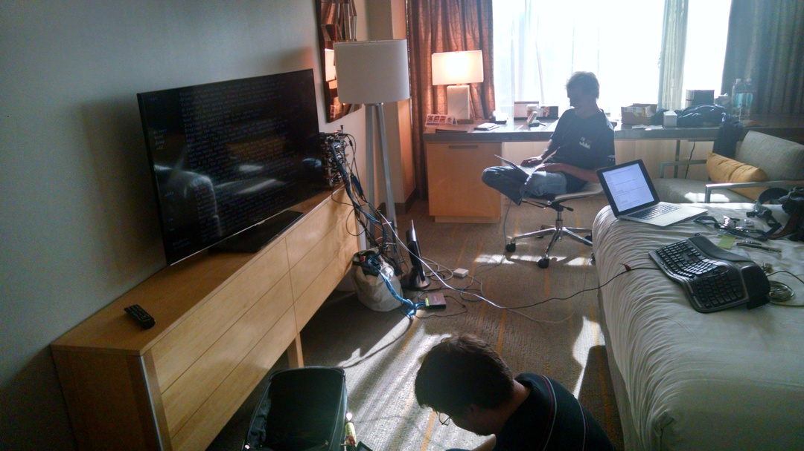
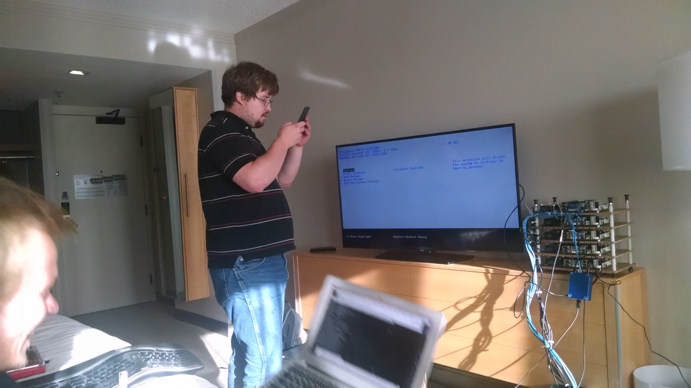

#News & events

## APE repository and runtime available 
7th August 2015

APE is working now. It's in a separate repository, look at [Harvey-OS github site](https://github.com/Harvey-OS/ape) to see it.
There are a [wiki](https://github.com/Harvey-OS/ape/wiki) there as well, with a getting started about how to compile and use it.

APE is now out of the tree, what means you can clone the repository whatever you want and compile it indepently from Harvey's
main tree. You just only need for now that libbsd and libap are linked to your ANSI program to run it in Harvey. You
can use Harvey's and APE runtimes together: both use same compiler, all include directories and all libs.

We hope porting tasks will be easier now.

## USENIX presentation slides available 
20th July 2015

Here are Harvey's [presentation slides](docs/Harvey-Usenix-2015-ATC-BOF-slides.pdf) at USENIX 2015 ATC BOF.

We will update this note when we can link to a video of the talk.

---

## Looking for developers!
15th July 2015

For the next couple of months, the project is looking for developers to step up and help get Harvey ready for prime time.

> "I think the big goal for the next two months, the single most important goal, is to move a needle: we want more people contributing"

There still exist areas for continued development, and YOU can make a difference. This experience can make for an ideal project for Operating System courses and the like. Please talk to us!

> "For new people: we have troubles with sdiahci.c, ahci driver. So we haven't local disk for now. It's not blocking at all, but other improvements depends on it. But, what would you like to do with Harvey meanwhile?"

---

##Harvey at USENIX 2015
08th July 2015

It's usenix and we have a BOF tomorrow night, so we have to get the
minicluster going. Five AMD Persimmon boards in a stack and 1 Minnow
MAX.

We had really high hopes for the minnow max but it is a bit of a
disappointment. Super neat size -- see the little blue box hanging
from an ethernet cable in the 5th picture? It was kind of exciting to
see so much in such a small box.

We've concluded that to make this board usable for Harvey we're going
to need to swap out UEFI for some other firmware. it took us 15
minutes just to walk through enough of the commands and dialogues to
realize we can only boot from a FAT-formatted SD card. FAT
formatted. 2015. What's wrong with this picture?

So then tried PXE boot. See John taking a movie of the TV? It's
because when UEFI pxeboot fails, it puts the failure frame up for 1/30
second and clears it. So John took a movie, and then we watched the
movie frame by frame to see the error. 

Then we hit the next problem: once we
got the special version of GRUB booting over the LAN, it told
us we wouldn't have a visible console. We need a console.

The AMD stack, with three coreboot nodes and two AMI BIOS nodes,
worked better. The only thing that went wrong is that the AMI BIOS
breaks pxelinux.0 -- it loads and gets to some point, and then instant
reset. We can still boot harvey on the AMI BIOS nodes, but only from a USB stick. 
We'll be reflashing these too. 

Harvey mini-cluster ready to fire up (or catch fire)

John on the floor, trying to make the minnowmax boot
Harvey, Aki on the chair making Harvey build on a mac and boot off of one.

John decided taking a video of the boot sequence would
be the best way to capture the sub-second error message.
